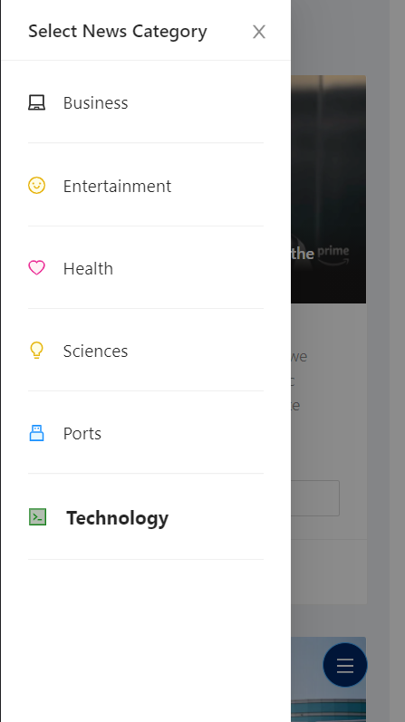

<h1> Wegodev Challenge - News Aggregator  </h1>

*Created by IlhamAdhim*    
Tech stacks: 
- React Hooks with Typescript
- Undraw.co for illustration
- Ant Design UI Library & Icons
- React Context for state management
- News API as 3rd party data provider

--------

## Screenshots

 
    When user opens up the website in their mobile phone.

   

 
    When user opens up the website in their mobile phone with horizontal view.

   

 
    User can select other news category in sidebar. The default category is 'Technology'

   

 
    Source of the original news is available in Dropdown 'see source'

   

 
    If user clicks 'Read more' at the bottom of each card news, it redirects them to the original news 

   

 
   Loading data from NewsAPI will gives this UI in user's phone

   

 
    If the fetching data process from NewsAPI returns error, it will display this page

